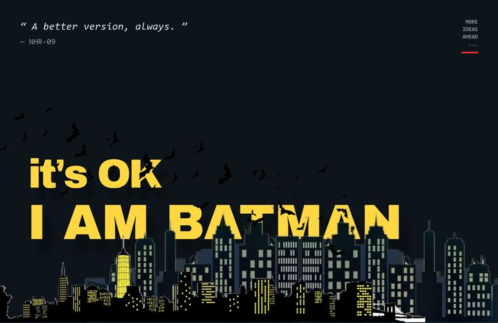

<!-- ORIGINAL SPIDER-MAN HERO BANNER (PRESERVED) -->

<!-- About Section [01] with Subtle PFP Avatar -->

<!-- Exploring Section [02] -->

<!-- Arsenal Section [03] -->

<!-- Repository Card (Clickable) -->

<!-- Connect Section [04] with Clickable SVGs -->

  
  

    
    
    
    
    
    
  

<!-- Footer Section -->

