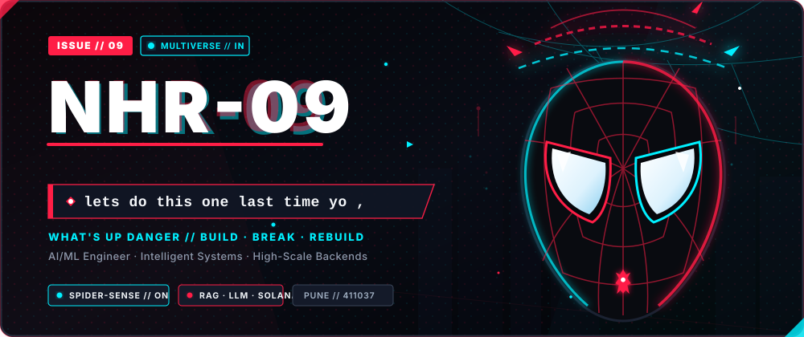
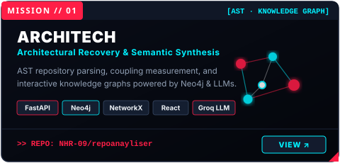
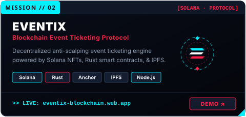
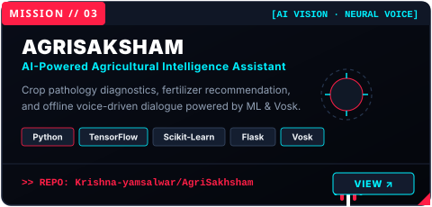
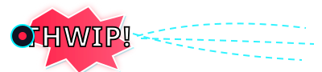

<!-- HERO BANNER -->

 

<!-- QUICK COMIC NAVIGATION -->

  <a href="#-spidey-dossier"><code><b>[ 🕷️ DOSSIER ]</b></code></a> &nbsp;•&nbsp;
  <a href="#-active-missions"><code><b>[ 🎯 MISSIONS ]</b></code></a> &nbsp;•&nbsp;
  <a href="#-tech-arsenal"><code><b>[ ⚔️ ARSENAL ]</b></code></a> &nbsp;•&nbsp;
  <a href="#-spider-signal"><code><b>[ 📡 SIGNAL ]</b></code></a> &nbsp;•&nbsp;
  <a href="#-transmit-signal"><code><b>[ 🕸️ TRANSMIT ]</b></code></a>

<!-- REAL-TIME TELEMETRY HUD -->

 

<!-- CONSOLE TERMINAL HUD -->

  

 

  

 

<!-- SECTION 01: ACTIVE MISSIONS -->

  

<table width="100%" border="0" cellspacing="0" cellpadding="0">
  <tr>
    <td width="50%" align="center" valign="top">
      
    </td>
    <td width="50%" align="center" valign="top">
      
    </td>
  </tr>
  <tr>
    <td colspan="2" align="center" valign="top">
       
      
    </td>
  </tr>
</table>

 

<!-- THWIP SOUND EFFECT BREAK -->

  

  

 

<!-- SECTION 02: TECH ARSENAL -->

  

<table width="100%" border="0">
  <tr>
    <th align="left" width="30%"><code>// DOMAIN</code></th>
    <th align="left" width="70%"><code>// EQUIPPED ARSENAL</code></th>
  </tr>
  <tr>
    <td><b>🧠 AI, ML &amp; Vision</b></td>
    <td><code>RAG Pipelines</code> · <code>LLM Orchestration</code> · <code>Vector Embeddings</code> · <code>Semantic Search</code> · <code>Computer Vision</code> · <code>TensorFlow</code></td>
  </tr>
  <tr>
    <td><b>⚙️ Backend &amp; Architecture</b></td>
    <td><code>Java (Spring Boot)</code> · <code>Python (FastAPI · Flask)</code> · <code>REST APIs</code> · <code>JWT Security</code> · <code>AST Parsing</code></td>
  </tr>
  <tr>
    <td><b>⛓️ Blockchain Protocols</b></td>
    <td><code>Solana Ecosystem</code> · <code>Rust</code> · <code>Anchor Framework</code> · <code>Metaplex NFTs</code> · <code>IPFS</code></td>
  </tr>
  <tr>
    <td><b>💾 Databases &amp; Graphs</b></td>
    <td><code>Neo4j (Graph DB)</code> · <code>PostgreSQL</code> · <code>MySQL</code> · <code>Firebase</code> · <code>NetworkX</code></td>
  </tr>
  <tr>
    <td><b>🛠️ Weapons &amp; Infrastructure</b></td>
    <td><code>Docker</code> · <code>Git / GitHub</code> · <code>Linux Systems</code> · <code>Postman</code> · <code>Vosk (Speech-to-Text)</code></td>
  </tr>
  <tr>
    <td><b>🧩 Core Foundations</b></td>
    <td><code>Data Structures &amp; Algorithms</code> · <code>OOP</code> · <code>DBMS</code> · <code>Distributed Systems</code></td>
  </tr>
</table>

 

  

 

<!-- SECTION 03: SPIDER-SIGNAL TELEMETRY -->

  

<!-- GitHub Stats & Streak with Spider-Verse Palette -->
<table border="0" cellspacing="0" cellpadding="8">
  <tr>
    <td align="center" valign="middle">
      
    </td>
    <td align="center" valign="middle">
      
    </td>
  </tr>
  <tr>
    <td colspan="2" align="center" valign="middle">
       
      
    </td>
  </tr>
</table>

 

 

  

 

<!-- SECTION 04: TRANSMIT SIGNAL -->

  

  <i>"Got an impossible problem to solve, an AI system to architect, or an open-source collaboration? Transmit an encrypted ping."</i>

  
  &nbsp;
  
  &nbsp;
  
  &nbsp;
  
  &nbsp;
  

 

<!-- EXPANDABLE CLASSIFIED DOSSIER EASTER EGG -->

  
<b>▸ [ CLASSIFIED // MULTIVERSE EASTER EGG ]</b>

   
  <blockquote>
    

      <b>NODE // NHR-09:</b> <i>"That's all it is, Miles. A leap of faith."</i> 
      Building intelligent AI architectures, pushing on-chain limits, and writing code that actually changes things. 
      No shortcuts. Just deep focus, relentless iteration, and a whole lot of coffee.
    

  </blockquote>

  

<!-- SPIDER GRAFFITI LOGO & FOOTER -->

 

  🕷️ <b>ISSUE // 09</b> · ARCHITECTED BY <a href="https://github.com/NHR-09">NHR-09</a> · <i>"Anyone can wear the mask. You could wear the mask."</i> 🕸️

