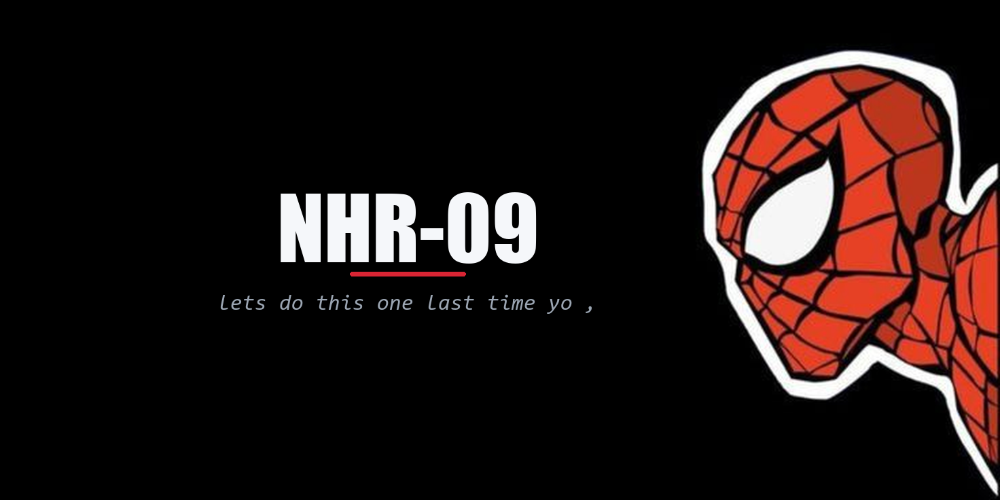
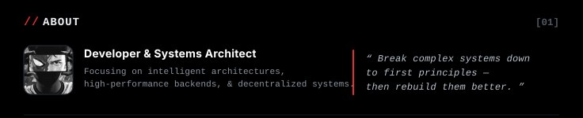
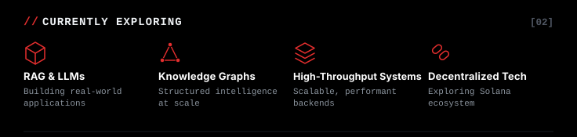
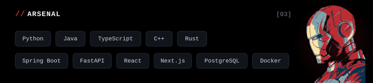
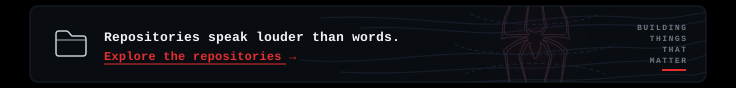
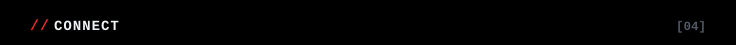
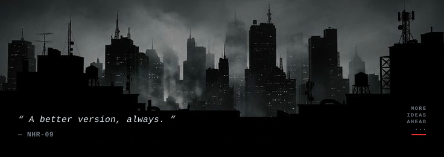

<!-- SPIDER-MAN HERO BANNER -->

 

<!-- ABOUT SECTION [01] -->

<!-- CURRENTLY EXPLORING SECTION [02] -->

<!-- ARSENAL TECH STACK [03] -->

<!-- REPOSITORY EXPLORER (CLICKABLE GATEWAY) -->

<!-- CONNECT SECTION [04] (CLICKABLE SVGS) -->

   &nbsp;&nbsp;&nbsp;&nbsp;
   &nbsp;&nbsp;&nbsp;&nbsp;
   &nbsp;&nbsp;&nbsp;&nbsp;
   &nbsp;&nbsp;&nbsp;&nbsp;
   &nbsp;&nbsp;&nbsp;&nbsp;
  

<!-- FOOTER NOIR SKYLINE -->

